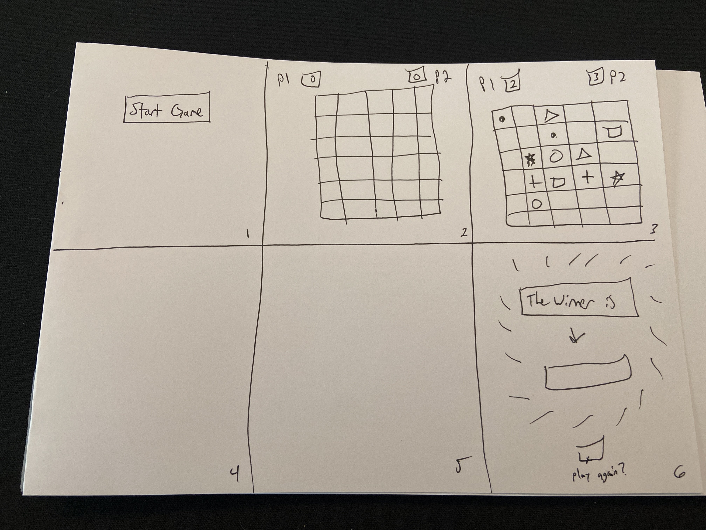

Matching Moodiez

-

Welcome to Matching Moodiez! This is a 2-Player game where memory is key. Players will take turns matching cards. If a Player finds a match, they earn a point and get to take another turn. Once all matches have been made, the Player with the most points is declared the winner! However, if both Players have the same number of points, the game will result in a draw.  Click "Start Game" when you are ready to play!

-

User Story:

The player clicks the "Start Game"" button to begin the game/shuffle the cards
Player 1 will start
If the clicked cards match, that player earns a point, and will have another turn
If the clicked cards do not match, then it will be Player 2's turn
The game will end once all cards are face up
The player with the most points, wins
If both players have the same amount of points, it will result in a draw

-

-

Credits:

Moodiez by Maze How are you feeling?

Twitter: https://twitter.com/MazeLabz

Mint Page: https://www.moodiez.art/

Collection: https://paintswap.finance/marketplace/fantom/collections/moodiez/nfts

-

Font: https://www.dafont.com/moody-babe.font

-

Forthcoming Features:

Highlighting the cards depending on the player that matched them

The player can input a name instead of the default "Player 1" and "Player 2"

Adding difficulty levels/options with adding a # of cards that don't have any matches

Choose the number of players (2 or more)

Being able to play the game on 2 different computers/browsers, online
